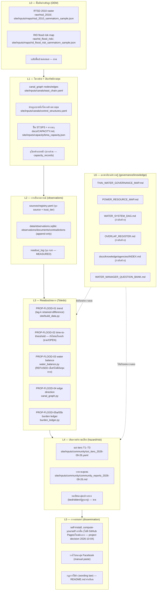

# สถาปัตยกรรม FloodConnect เทียบกับกรอบสากลด้านการจัดการน้ำ

**คำร้องขอต้นทาง (founder, verbatim):** "แผนที่ต่างๆ ระดับน้ำ โครงสร้างเมืองอื่นๆ ตามศาสตร์ด้าน
การจัดการน้ำระดับโลก นายทำให้ floodconnect ถูกวางระบบด้วยแบบนั้นเลย" และ "ให้คนที่ใช้ git นี้เข้าใจ
แนวทางแก้ปัญหาได้ทันที"

**วินัย tag ของไฟล์นี้**: กรอบสากลทุกกรอบในหมวด (1) ติด **RELAYED** — เป็นความรู้ทั่วไปเกี่ยวกับ
แนวปฏิบัติสากล ไม่ได้อ้างเอกสารทางการฉบับใดฉบับหนึ่งโดยเฉพาะ (เขียน "อ้างอิง: ต้องเติม" ตรงจุดที่ควร
มีการอ้างอิงที่เป็นทางการ — ห้ามกุลิงก์/เลขหน้าที่ไม่ได้ตรวจสอบ) สถานะ "มีในคลัง" ทุกจุดใน (2)-(4)
ติด **VERIFIED** เฉพาะที่อ่านไฟล์จริงในคลังนี้แล้วเท่านั้น (ระบุชื่อไฟล์กำกับ) ส่วนแผนงาน/การจัดลำดับ
ใน (2)-(5) ติด **INSTINCT**

---

## (1) กรอบสากลที่ใช้วาง FloodConnect

### (a) Source–Pathway–Receptor–Consequence (SPRC)

**RELAYED** (อ้างอิง: ต้องเติม) — กรอบวิเคราะห์ความเสี่ยงน้ำท่วมที่ใช้กว้างขวางในงานวิศวกรรม/นโยบาย
น้ำของสหราชอาณาจักรและยุโรป แบ่งห่วงโซ่ความเสี่ยงเป็น 4 องค์ประกอบ: **Source** (ต้นกำเนิดน้ำ — ฝน,
น้ำเหนือ, น้ำทะเลหนุน), **Pathway** (เส้นทางที่น้ำไหล/ท่วมไปถึง — คลอง, ท่อ, ถนน, ที่ลุ่ม),
**Receptor** (สิ่ง/คนที่รับผลกระทบ — บ้าน, คนป่วยติดเตียง, โครงสร้างพื้นฐาน), **Consequence**
(ผลลัพธ์ที่วัดได้ — ความเสียหาย, การเสียชีวิต, การหยุดชะงัก) กรอบนี้เรียกร้องให้ระบบเฝ้าระวังมี "ข้อมูล
ครบทั้ง 4 จุด" ไม่ใช่แค่จุดเดียว (เช่น มีแต่ Source แต่ไม่มี Receptor ก็บอกความเสี่ยงจริงไม่ได้)

**FloodConnect เทียบกับ SPRC**: มี Source ครบ (ฝน/น้ำเหนือ/น้ำหนุน — ดู `docs/CAPACITY.md`,
`site/inputs/tide/`) มี Pathway บางส่วน (คลอง/ประตู/ปั๊ม — `canal_graph.py`, ยังไม่มีระดับพื้นบ้าน/
ถนนแบบละเอียด) แต่ **Receptor แทบไม่มี** (ไม่มีทะเบียนผู้ป่วยติดเตียง/ผู้สูงอายุต่อซอย) และ
Consequence มีแค่ระดับ "soi tier" หยาบ ไม่ใช่ความเสียหายเชิงปริมาณ — จุดอ่อนที่สุดของสถาปัตยกรรม
ปัจจุบันคือ Receptor (ดูตาราง §3)

### (b) EU Floods Directive-style map stack (DEM → network → hazard → risk)

**RELAYED** (อ้างอิง: ต้องเติม) — แนวปฏิบัติจาก EU Floods Directive (2007/60/EC) และคู่มือ
hazard/risk mapping ทั่วไป วางเลเยอร์แผนที่เป็นลำดับ: **DEM/ระดับพื้นดิน** → **โครงข่ายชลศาสตร์ +
สินทรัพย์ควบคุม** (คลอง/ประตู/ปั๊ม) → **แผนที่อันตราย (hazard map) ต่อสถานการณ์/ระดับน้ำ** →
**แผนที่ความเสี่ยง = อันตราย × การรับสัมผัส (exposure) × ความเปราะบาง (vulnerability)** กรอบนี้
เรียกร้องว่าแผนที่ความเสี่ยงต้อง "คำนวณต่อกันเป็นชั้น" ไม่ใช่แผนที่เดี่ยว ๆ ที่แยกจากกัน

**FloodConnect เทียบกับ map stack**: มี DEM ดิบ (RTSD 2010) และแผนที่เสี่ยง RID เป็น raster
อ้างอิงแล้ว (`raw/rtsd_2010`, `raw/rid_flood_risk` — ดู §2 L0) แต่ **ยังไม่ได้ประกอบเป็น stack
จริง** — ไม่มีการ sample DEM ต่อซอย ไม่มี hazard map ต่อ scenario ระดับน้ำ และไม่มี risk map
ที่คูณ exposure×vulnerability เลย ระบบปัจจุบันคือชั้น network (L1) กับชั้น readout (L3) ที่ต่อกัน
โดยตรง ข้าม hazard/risk layer ไปเกือบทั้งหมด

### (c) WMO/UNDRR People-Centred Early Warning (4 องค์ประกอบ)

**RELAYED** (อ้างอิง: ต้องเติม) — กรอบ Early Warnings for All ของ WMO/UNDRR แบ่งระบบเตือนภัย
ที่ดีเป็น 4 องค์ประกอบที่ต้องมีครบและเชื่อมกัน: **(1) ความรู้ความเสี่ยง** (risk knowledge — รู้ว่า
ใครเสี่ยงอะไรตรงไหน) **(2) การตรวจวัด/พยากรณ์** (monitoring & forecasting) **(3) การสื่อสาร/
กระจายข่าว** (dissemination & communication — ไปถึงคนที่เสี่ยงจริง) **(4) ความสามารถเตรียมพร้อม/
ตอบสนอง** (preparedness & response capability — คนรู้ว่าต้องทำอะไรเมื่อได้รับเตือน) กรอบนี้เน้นว่า
"เตือนได้แต่คนไม่รู้จะทำอะไร" ก็ยังนับว่าระบบล้มเหลว

**FloodConnect เทียบกับ EWS 4 องค์ประกอบ**: (1) risk knowledge — บางส่วน (soi tier, ยังไม่มี
per-household) (2) monitoring — ดีที่สุดในระบบ (`sources/registry.yaml`, telemetry หลายแหล่ง)
แต่ forecasting มีแค่ Open-Meteo บุคคลที่สาม ไม่มี hydraulic routing (3) dissemination — ทางเดียว
และต้องรันเอง (self-install/compute-yourself เท่านั้น ตั้งแต่ project decision 2026-10-04 — ไม่มี
GitHub Pages หรือโฮสต์กลางใดๆ อีกแล้ว), ไม่มีช่องทางยืนยันกลับ (two-way ack), ไม่มี fallback
วิทยุ/SMS เมื่อไฟฟ้า/เน็ตล่ม (4) preparedness/response — ไม่มีในระบบเลย (ไม่มี SOP ต่อระดับภัยที่
ผูกกับหน้าเว็บ)

### (d) Dutch multi-layer safety (MLS): prevention · spatial planning · crisis management

**RELAYED** (อ้างอิง: ต้องเติม) — แนวทาง "Meerlaagsveiligheid" ของเนเธอร์แลนด์ แบ่งการป้องกัน
น้ำท่วมเป็น 3 ชั้นที่ไม่พึ่งชั้นเดียว: **Layer 1 การป้องกัน** (เขื่อน/คันกั้น/ประตู — ลดโอกาสน้ำเข้า)
**Layer 2 การผังเมือง/การก่อสร้างเชิงพื้นที่** (ลดผลกระทบเมื่อน้ำเข้าจริง — ยกพื้น, พื้นที่รับน้ำ)
**Layer 3 การจัดการภาวะวิกฤต** (อพยพ/เตือนภัย/กู้ภัยเมื่อ Layer 1-2 ไม่พอ) หลักคิดคือถ้า Layer 1
ล้มเหลว ยังมี Layer 2-3 รองรับ ไม่ใช่ระบบที่ล้มทีเดียวหมด

**FloodConnect เทียบกับ MLS**: โครงการนี้ไม่ควบคุม Layer 1-2 เลย (เป็นของ กทม./รัฐ) — FloodConnect
คือเครื่องมือสนับสนุน **Layer 3 เท่านั้น** (ข้อมูลเพื่อการตัดสินใจระดับครัวเรือน/ชุมชนช่วงวิกฤต) การ
เข้าใจตำแหน่งนี้สำคัญ: FloodConnect ไม่ใช่ระบบป้องกันน้ำท่วม แต่เป็นเลเยอร์ข้อมูลของ Layer 3 ที่ยัง
ไม่มีมาก่อนในระดับหมู่บ้าน

### (e) Sendai Framework — 4 priorities (สรุปบรรทัดเดียว)

**RELAYED** (อ้างอิง: ต้องเติม) — Sendai Framework for Disaster Risk Reduction 2015-2030
วาง 4 ลำดับความสำคัญ: (1) เข้าใจความเสี่ยงภัยพิบัติ (2) เสริมธรรมาภิบาลความเสี่ยง (3) ลงทุนลดความ
เสี่ยงเพื่อความยืดหยุ่น (4) เพิ่มความพร้อมรับมือเพื่อการตอบสนองที่มีประสิทธิผลและ "build back better"
FloodConnect แตะ priority (1) และ (4) บางส่วนผ่านข้อมูลเปิด แต่ไม่แตะ (2)/(3) เพราะอยู่นอกอำนาจของ
อาสาสมัครกลุ่มเล็ก

---

## (2) สถาปัตยกรรม FloodConnect ที่วางตามกรอบ (L0–L6)

### รายละเอียดต่อชั้น: มีอะไร / ขาดอะไร / รับใช้กรอบไหน

**L0 — พื้นดิน/DEM**
- มี (**VERIFIED** อ่าน `sources/registry.yaml` id `rtsd_2010_ground_level_map`,
  `rid_flood_risk_map`): raster DEM กรมแผนที่ทหาร 2010 และแผนที่เสี่ยงกรมชลประทาน ถูกอ้างเป็น static
  reference asset ใน registry แล้ว แต่ **"ไม่ได้ wired เข้า observations/documents โดย pipeline
  ขั้นนี้"** (ข้อความในไฟล์เอง)
- ขาด: ระดับพื้นบ้าน/ธรณีประตูต่อซอย (village floor levels) — ไม่มีไฟล์ใดในคลังให้ค่านี้
- รับใช้กรอบ: (b) map-stack ชั้นล่างสุด, (a) SPRC's Pathway (ภูมิประเทศกำหนดเส้นทางน้ำ)

**L1 — โครงข่าย + สินทรัพย์ควบคุม**
- มี (**VERIFIED** อ่าน `site/inputs/canals/east_chain.yaml`, `site/inputs/canals/
  control_structures.yaml`, `docs/CAPACITY.md`): กราฟคลอง node/edge ที่ประกอบเอง, ประตูระบายน้ำที่
  ประกาศ (declared), ปั๊ม ST.SPS.01-04 (ไม่มีเลขความจุ — OPEN ใน CAPACITY.md), ความจุสถานีสูบ/อุโมงค์
  บางเส้น (`capacity_records`)
- ขาด: ความจุอุโมงค์พระราม 9-รามคำแหง (OPEN ใน CAPACITY.md), จำนวนสถานีสูบ/ประตูทั้งเมืองที่แน่นอน
  (ขัดแย้งกันเองในแหล่ง RELAYED)
- รับใช้กรอบ: (b) map-stack ชั้นที่ 2, (d) MLS Layer 1 (การป้องกัน — แต่ FloodConnect ไม่ควบคุมชั้นนี้
  เพียงอ่านค่า)

**L2 — การสังเกตการณ์**
- มี (**VERIFIED** อ่าน `sources/registry.yaml`, `docs/DATA_SYSTEM.md`): registry ประกาศทุก source
  พร้อม trust_tier/host_rule, เก็บลง `data/observations.sqlite` แบบ append-only (ตาราง
  `observations, documents, method_evaluation, contradictions, readout_log`), collect.py จำกัด
  1 request/URL/run ไม่มี retry loop
- ขาด: sensor เฉพาะจุด (ท่อลอดถนนรามคำแหง/คลองบ้านม้า, ไม้วัดระดับบึงสัมมากร) — ระบุชัดใน
  `docs/LESSONS_nodes_2026-09-27.md` หมวด B ว่า "ไม่มีเซนเซอร์วัดของตัวเอง"
- รับใช้กรอบ: (c) EWS องค์ประกอบ (2) monitoring — แข็งแรงที่สุดในระบบ

**L3 — Readout/สมการ (Toledo)**
- มี (**VERIFIED** อ่าน `site/build_data.py`, `water_balance.py`, `canal_graph.py`,
  `burden_ledger.py`): PROP-FLOOD-01 (trend, lag-k retained-difference), PROP-FLOOD-03 (water
  balance — REFUSED เป็นค่า default ที่ระดับหมู่บ้านตาม `docs/CAPACITY.md` §7 จนกว่าจะมีอินพุตครบ),
  PROP-FLOOD-04 (edge direction), PROP-FLOOD-05a/05b (burden ledger + zone order) — ทุกตัว
  ลงทะเบียน/อ้างอิง Toledo code ในตัวไฟล์ และ REFUSED ถือเป็น first-class state (ไม่ fabricate ค่า)
- ขาด: **PROP-FLOOD-02 (time-to-threshold) — ค้นทั้งคลังไม่พบว่ามีการอ้างอิงหรือ implement จริง**
  (grep `PROP-FLOOD-02` ในทุกไฟล์ .py/.md ไม่พบ) — นี่คือช่องว่างเปิด (OPEN) ไม่ใช่ของที่มีอยู่แล้ว
- รับใช้กรอบ: (a) SPRC's Source→Pathway (สมการอธิบายการเคลื่อนตัวของน้ำในโครงข่าย), (c) EWS
  องค์ประกอบ (1)/(2) บางส่วน

**L4 — อันตราย/ความเสี่ยง**
- มี (**VERIFIED** อ่าน `site/inputs/community/soi_tiers_2026-09-26.yaml`,
  `community_reports_2026-09-26.md`): การจัดชั้นซอย (soi tier) ตามข้อมูลชุมชน, รายงานภาคสนาม
- ขาด: ทะเบียนกลุ่มเปราะบาง (ผู้ป่วยติดเตียง/ผู้สูงอายุ/เด็กเล็กต่อครัวเรือน) — ไม่มีไฟล์ใดในคลังให้
  ข้อมูลนี้ (ยืนยันจาก §0.6 ของ `THAI_WATER_GOVERNANCE_MAP.md`: "ยังไม่พบข้อมูลคณะกรรมการ/กองทุน/
  ผู้ประสานงานของหมู่บ้านในคลัง")
- รับใช้กรอบ: (a) SPRC's Receptor — ช่องว่างที่ใหญ่ที่สุดของทั้งสถาปัตยกรรม, (b) map-stack's
  exposure×vulnerability

**L5 — การเผยแพร่**
- **VERIFIED (ปัจจุบัน, 2026-10-04)**: GitHub Pages เปิดใช้งาน **เฉพาะ** `site/landing/`
  (หน้าอธิบายโครงการแบบ static ไม่มีข้อมูลน้ำท่วม) ผ่าน `.github/workflows/pages-landing.yml`
  — ไม่มีการ serve `site/dist`/`api/v1` ผ่าน Pages หรือโฮสต์กลางอื่นใด — project decision
  "เคลียร์ช่องทางเข้าถึงออกซิ" ถอด `site/dist/api/v1/**` ที่ tracked ออกจากคลังทั้งหมด
  ผู้ติดตั้งต้อง clone + รัน `collect.py --all` + `site/build_data.py` +
  `tools/api/export_api.py` (หรือ `floodconnect answer` โดยไม่ใส่ `--offline` — refresh เป็น
  default) บนเครื่องตัวเองเสมอ ไม่มีทางลัดอ่านค่าที่คำนวณไว้แล้วจากที่ใด *(historical note:
  ก่อน 2026-10-02 เคยเป็น cron 30 นาที; ก่อน 2026-10-03 workflow เคยรัน `collect.py --all` บน
  runner ของเราด้วย — เอาออกแล้ว ตอนนี้ collect เป็น caller-side เท่านั้น, และก่อน 2026-10-04
  Pages เคยเปิดกว้างกว่านี้ ตอนนี้เหลือแค่หน้า landing static)*, วางไว้บนกลุ่ม
  Facebook ด้วยมือ (manual paste), มีคำเตือน
  บังคับในหน้าเว็บ/README (ไม่ใช่การพยากรณ์/ยืนยันความปลอดภัย)
- ขาด: ช่องทางสื่อสารสองทาง (ไม่มีการยืนยันกลับว่าคนได้รับ/เข้าใจ), ไม่มี fallback วิทยุ/SMS เมื่อ
  ไฟฟ้า/อินเทอร์เน็ตล่ม (ตรงกับ §0.2 ของ governance map — ระบบสื่อสารพึ่งไฟฟ้า/สัญญาณเดียวกับที่ล่ม
  ตอนน้ำท่วมจริง)
- รับใช้กรอบ: (c) EWS องค์ประกอบ (3) dissemination — ทางเดียวเท่านั้น

**L6 — ธรรมาภิบาล/ความรู้**
- มี (**VERIFIED** อ่านตรง): `THAI_WATER_GOVERNANCE_MAP.md` (ปัญหาจริง 8 ข้อ, ชั้นอำนาจ),
  `POWER_RESOURCE_MAP.md` (ผังอำนาจตามรัฐธรรมนูญ-หน่วยงาน), `WATER_MANAGER_QUESTION_BANK.md`
  (matrix คำถาม×สถานะข้อมูล), `docs/knowledge/README.md` (ดัชนีเอกสาร 5 ระดับภูมิศาสตร์)
- ขาด/กำลังสร้าง (ตรวจแล้วว่ายังไม่มีไฟล์ ณ เวลาที่เขียนเอกสารนี้): `WATER_SYSTEM_DAG.md`,
  `OVERLAP_REGISTER.md`, `docs/knowledge/agencies/INDEX.md` (โฟลเดอร์ `docs/knowledge/agencies/`
  มีอยู่แต่ว่างเปล่า)
- รับใช้กรอบ: (c) EWS องค์ประกอบ (1) risk knowledge เชิงโครงสร้าง, (e) Sendai priority (2)
  ธรรมาภิบาลความเสี่ยง (ในขอบเขตของทีมอาสาสมัคร — ไม่ใช่การกำหนดนโยบาย)

---

## (3) ตารางความครอบคลุม (coverage table)

**INSTINCT** สำหรับคอลัมน์ "สถานะ"/"งานถัดไป" — เนื้อหาว่ามีไฟล์ใดอิงจาก VERIFIED ที่อ่านจริงตาม (2)

### SPRC (4 องค์ประกอบ)

| องค์ประกอบ | ส่วนประกอบ FloodConnect | สถานะ | ไฟล์/โหนด | งานถัดไป |
|---|---|---|---|---|
| Source | ฝน/น้ำเหนือ/น้ำหนุน | มีบางส่วน | `sources/registry.yaml` (thaiwater_rain_24h, openmeteo_forecast, dds_tide_pdf) | เพิ่ม TMD seasonal outlook (ปัจจุบันมีแต่ Open-Meteo third-party) |
| Pathway | คลอง/ประตู/ปั๊ม/อุโมงค์ | มีบางส่วน | `canal_graph.py`, `site/inputs/canals/*.yaml`, `docs/CAPACITY.md` | เติมความจุอุโมงค์พระราม 9-รามคำแหง (OPEN), ปั๊ม ST.SPS (OPEN) |
| Receptor | คนที่เสี่ยง | ขาด | ไม่มีไฟล์ | สร้างทะเบียนกลุ่มเปราะบางต่อซอย (bedridden/ผู้สูงอายุ) — ต้องมีความยินยอมและความปลอดภัยข้อมูลส่วนบุคคล |
| Consequence | ความเสียหาย/ผลกระทบวัดได้ | มีบางส่วน | `site/inputs/community/soi_tiers_2026-09-26.yaml` (T1-T3 หยาบ) | ผูก soi tier กับ Receptor เพื่อคำนวณผลกระทบจริง |

### Map stack (4 ชั้น)

| ชั้น | ส่วนประกอบ FloodConnect | สถานะ | ไฟล์/โหนด | งานถัดไป |
|---|---|---|---|---|
| DEM/ระดับพื้นดิน | RTSD 2010 raster | มีบางส่วน | `raw/rtsd_2010/`, `site/inputs/maps/rtsd_2010_sammakorn_sample.json` | sample ค่าระดับต่อซอยจริง (ยังไม่ทำ) |
| โครงข่าย+สินทรัพย์ | canal_graph | มีแล้ว | `canal_graph.py`, `control_structures.yaml` | เติมประตู/ปั๊มที่ยังไม่ประกาศ |
| Hazard map ต่อสถานการณ์ | — | ขาด | ไม่มีไฟล์ | ต้องมีระดับพื้นบ้าน + hydraulics ของ culvert ก่อน |
| Risk map (hazard×exposure×vuln) | — | ขาด | ไม่มีไฟล์ | ต้องรอ Receptor (SPRC) เสร็จก่อน |

### WMO/UNDRR EWS (4 องค์ประกอบ)

| องค์ประกอบ | ส่วนประกอบ FloodConnect | สถานะ | ไฟล์/โหนด | งานถัดไป |
|---|---|---|---|---|
| Risk knowledge | governance map, soi tier | มีบางส่วน | `THAI_WATER_GOVERNANCE_MAP.md`, `soi_tiers_2026-09-26.yaml` | เติม per-household vulnerability |
| Monitoring & forecasting | telemetry หลายแหล่ง + Open-Meteo | มีบางส่วน | `sources/registry.yaml` | Forecasting พึ่งโมเดลบุคคลที่สามเท่านั้น ไม่มี hydraulic routing ของโปรเจกต์เอง |
| Dissemination & communication | self-install/compute-yourself + FB paste (ไม่มี GitHub Pages — project decision 2026-10-04) | มีแต่ทางเดียว | `README.md` | ไม่มี two-way confirm, ไม่มี fallback วิทยุ/SMS |
| Preparedness & response capability | — | ขาด | ไม่มีไฟล์ | ยังไม่มี SOP ต่อระดับภัยที่ผูกกับหน้าเว็บ |

### Dutch Multi-Layer Safety (3 ชั้น)

| ชั้น | ส่วนประกอบ FloodConnect | สถานะ | ไฟล์/โหนด | งานถัดไป |
|---|---|---|---|---|
| Prevention (Layer 1) | นอกขอบเขต — ของ กทม./รัฐ | ขาด (โดยเจตนา) | — | ไม่ใช่งานของโปรเจกต์นี้ ทำได้แค่อ่านค่า |
| Spatial planning (Layer 2) | นอกขอบเขต | ขาด (โดยเจตนา) | — | เช่นเดียวกับข้างบน |
| Crisis management (Layer 3) | ข้อมูล+เผยแพร่ช่วงวิกฤต | มีบางส่วน | L2-L5 ทั้งชุด | นี่คือขอบเขตจริงของ FloodConnect — เติม preparedness/response (ดู EWS องค์ประกอบ 4) |

---

## (4) "แผนที่ที่ FloodConnect ควรมี" (ตามศาสตร์สากล §1)

| แผนที่ | แหล่งที่ควรใช้ | สถานะ |
|---|---|---|
| DEM/ระดับพื้นดินต่อซอย | RTSD 2010 raster มีอยู่แล้ว (`raw/rtsd_2010`) — ต้อง sample ค่าต่อซอยเพิ่ม | มีข้อมูลดิบ, ขาดการ sample |
| โครงข่ายน้ำพร้อมสถานะสด | มีอยู่แล้วเป็น canal graph (`canal_graph.py` + `site/inputs/canals/`) | มีแล้ว |
| แผนที่อันตรายตามสถานการณ์ระดับคลอง | ขาด — ต้องการระดับพื้นบ้าน + hydraulics ของ culvert (ท่อลอด) | ขาด |
| แผนที่ความเสี่ยง (อันตราย × ผู้ป่วยติดเตียง/ผู้สูงอายุ) | ขาด — ต้องมีทะเบียนกลุ่มเปราะบางก่อน | ขาด |
| แผนที่จุดอพยพ/ศูนย์พักพิง | ขาด | ขาด |
| แผนที่เส้นทางเดินเท้าจุดที่น้ำเข้าก่อน (first-water-entry) | ขาด — ตรงกับ checklist ช่องว่างสัมมากรใน `THAI_WATER_GOVERNANCE_MAP.md` §7 | ขาด |

---

## (5) ลำดับงานที่ทำให้ FloodConnect "ระดับโลกจากข้อมูลจำกัดที่สุด" (INSTINCT)

6 โหนดขั้นต่ำที่ตกลงกันวันนี้ (2026-09-27) เทียบกับองค์ประกอบกรอบสากลที่แต่ละโหนดปิดช่องว่างให้:

| # | โหนด | องค์ประกอบกรอบที่ปิดช่องว่าง |
|---|---|---|
| 1 | ระดับท่อลอดถนน (culvert level) | SPRC's Pathway; map-stack's network layer; EWS's monitoring |
| 2 | ระดับบึง/สระ (pond level) | SPRC's Source (น้ำเริ่มต้นในบึง — อินพุตที่ PROP-FLOOD-03 ยังขาด ตาม `docs/CAPACITY.md` §7) |
| 3 | ไม้วัดระดับ 3–5 ซอย (gauge stick) | SPRC's Receptor proxy; EWS's risk knowledge — ตรงกับบทเรียนที่ใหญ่ที่สุดใน `docs/LESSONS_nodes_2026-09-27.md` หมวด B ("เซนเซอร์หนึ่งตัว... มีค่ามากกว่าการเพิ่มแหล่งข้อมูลทางการอีก 10 แหล่ง") |
| 4 | สถานะประตูที่เผยแพร่ (published gate states) | SPRC's Pathway; MLS Layer 1 readout; ปิดจุดบอดทางการเมืองที่ใหญ่ที่สุดตาม `docs/LESSONS_nodes_2026-09-27.md` (สถานะประตูมีนบุรี/ประเวศ-ลาดกระบัง "ไม่เผยแพร่ ต้องอนุมานเอง") |
| 5 | สำรวจค่าคงที่ทางกายภาพ (culvert/pipe geometry) | Map-stack's hazard-map prerequisite (hydraulics ของ culvert); PROP-FLOOD-02 (time-to-threshold) ที่ยังไม่มี implement — ต้องมีค่าคงที่นี้ก่อนจึงจะเขียนสมการได้ |
| 6 | สถานะกำลังไฟฟ้าปั๊ม (pump power status) | EWS's monitoring; ตรงกับข้อสังเกต `docs/LESSONS_nodes_2026-09-27.md` ข้อ C5 (สถานีขัดข้องพร้อมกัน = สัญญาณไฟฟ้า/telemetry มากกว่าปัญหาเครื่องปั๊ม) |

หมายเหตุ: ทั้ง 6 โหนดนี้เป็น**ข้อมูลภาคสนามที่ต้องมีคนไปวัด/บันทึก** ไม่ใช่ของที่ pipeline ปัจจุบัน
ดึงเองได้ — ตรงกับหลักการ "readout ที่แท้จริงต้องมีคนยืนยันหน้างาน ไม่ใช่แค่ประกอบจากแหล่งทางการที่
มีช่องว่างอยู่แล้ว"
