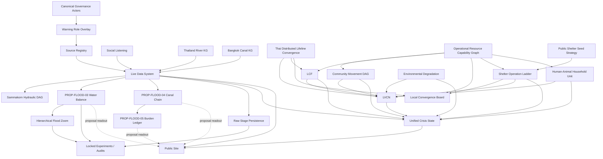

# FloodConnect Repository Knowledge Graph — Human View

> Canonical machine-readable graph:
> `site/inputs/meta/floodconnect_repo_kg.yaml`
>
> AI entry:
> `docs/AI_ENTRYPOINT.md`
>
> This file is a readable view, not a second source of truth.

## System map



## Three repository branches

### 1. Operational branch

Use for current response/shelter/community questions.

```text
official/live evidence
  -> movement/support topology
  -> LCF / LVCN / shelter capability
  -> Unified Crisis State
  -> explained operational readout
```

Main artifacts:
- `sources/registry.yaml`
- `collect.py / parsers.py / store.py / readout.py`
- `site/inputs/community/self_help_dag.yaml`
- `site/inputs/community/sustainment_policy.yaml`
- `community_dag.py`
- `shelter_decision.py`
- `convergence_feasibility.py`
- `shelter_operation_ladder.py`
- `unified_crisis_state.py`

### 2. Proposal / modelling branch

Use for theory, quantitative experiments and model development. Do not silently present it as
operational truth.

```text
PROP-FLOOD-03 water balance
PROP-FLOOD-04 declared canal-chain direction
PROP-FLOOD-05 control-structure burden
hierarchical urban -> node -> point zoom
raw-stage threshold persistence
```

### 3. Experiment / audit branch

Immutable/locked prospective tests, retrospective backtests and audits belong here.

Important rule:

```text
locked experiment != production rule
post-hoc audit != hindsight rewrite
```

The old S0–S5 state machine in the 7-day Sammakorn retrospective is historical. Current canonical
decision composition is the orthogonal **Unified Crisis State**.

## Node ontology

| Node type | Meaning | Examples |
|---|---|---|
| hydraulic node | water/control topology | river, canal, pond, gate, pump station |
| community node | people/support geography | household, buddy, zone, internal safe, egress |
| service node | functional service capability | kitchen, supply point, vet team, charging |
| shelter-operation node | physical site capability | SO-L0 through SO-L4 |
| tool node | deployable capability | vehicle, boat, generator, pump, water tank |
| governance actor | institutional identity | TMD, RID, DWR, ONWR, DDPM, BMA DDS |
| information product | semantic type of claim/action | observation, forecast, warning, instruction |

Do not collapse these node classes.

## The two graphs that must never be merged

```text
G_move     = resident movement
G_support  = resources/helpers/services
```

A resident route can be blocked while resources still move inward by boat.
A service can reach a household without making the household-to-shelter route safe.

## Canonical identity

Agency identities are stored once:

`site/inputs/governance/thailand_water_governance_reference.json#verified_anchors`

Role overlays such as warning roles reference those IDs.

Example:

```text
actor node: tmd
    |
    +-- role: METEOROLOGICAL_OBSERVER_FORECASTER
```

Never create another TMD object in a separate ontology.

## The shelter chain

```text
Dry Gate
  -> SO-L0 Dry Interface
  -> SO-L1 Relief Transfer
  -> SO-L2 Day Support
  -> SO-L3 Overnight Shelter
  -> SO-L4 Full Shelter Operation
```

A tool can help close a capability gap, but:

```text
pump present       != Dry Gate passed
generator present  != critical power sufficient
water truck exists != water sufficient for horizon
4x4 exists         != flooded road safe
```

## The community support chain

```text
household
  -> buddy cell
  -> zone
  -> internal/community support
  -> external safe node
```

LVCN asks for the **lowest known viable support layer**, not the biggest available shelter.

## Governance-warning chain

```text
OBSERVE
  -> INTERPRET_SECTOR
  -> INTEGRATE
  -> PUBLIC_WARN
  -> LOCAL_WARN_AND_ACT
```

This is a role graph, not a single command chain.

## How an AI should traverse the repo

```text
user question
   |
   v
docs/AI_ENTRYPOINT.md
   |
   v
question_routes in floodconnect_repo_kg.yaml
   |
   v
canonical 2–5 artifacts
   |
   v
answer with epistemic class preserved
```

Avoid broad repo scans for routine questions once a route exists.

## Validation

Run:

```bash
python3 repo_knowledge_graph.py --validate
python3 repo_knowledge_graph.py --export
```

The second command creates generated GraphML and JSON-LD views under `output/`.

The YAML remains canonical.
