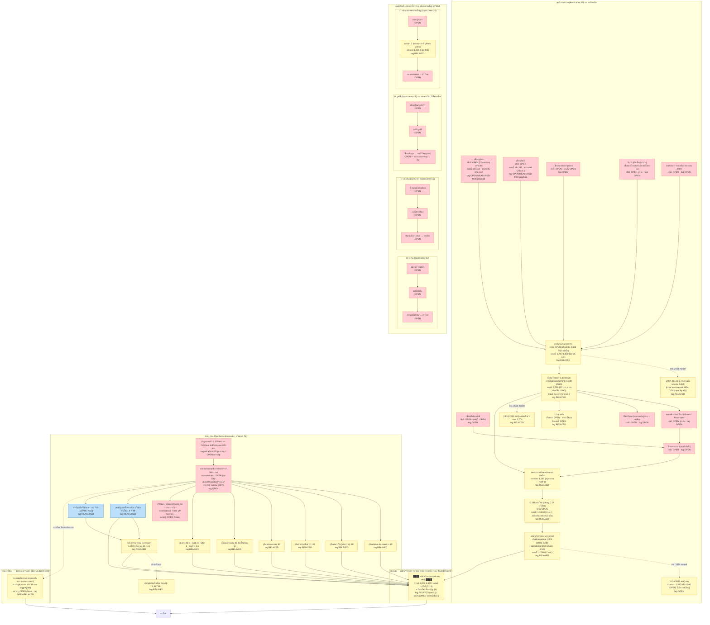

# ผังความสามารถระบายน้ำ — ลำน้ำ/แม่น้ำ/เครื่องมือ ทั้งประเทศ (โฟกัสเจ้าพระยา→กรุงเทพฯ)

**บันทึกเข้า**: 2569-09-27 · **โจทย์ founder (16:40, คำต่อคำ)**: "ทำผังให้ครบทั้งเรื่อง ความสามารถของการ
ระบายน้ำตามปกติ ของลำน้ำ แม่น้ำ และความสามารถของเครื่องมือต่างๆ" · **คำแก้ไข (16:44)**: "แต่เจ้าพระยาก็เป็น
ทางออกน้ำไม่ใช่เรอะ" — เจ้าพระยา (และอ่าวไทยผ่านคลองพระองค์ฯ/ชายทะเล) ถูกวาดในเอกสารนี้เป็น **ทางออก/
ขอบเขต (outfall/boundary)** ของระบบระบายน้ำ กทม. ไม่ใช่แค่ต้นทาง · **คำสั่งเพิ่ม (16:58, คำต่อคำ)**: "ต้อง
ไม่ใช่แค่ กทม. นะ อย่าลืม" — เอกสารนี้จึงครอบคลุมทั้งประเทศ โดยใช้สายเจ้าพระยาเป็น "ตัวอย่างที่ละเอียดที่สุด"
และลุ่มน้ำอื่นเป็นโครงร่าง (skeletal, ส่วนใหญ่ OPEN เพราะยังไม่มีตัวเลขความจุตีพิมพ์ในแหล่งที่โปรเจกต์นี้
เก็บไว้)

**Tag รวม**: ผสม VERIFIED/RELAYED/MEASURED/OPEN แยกต่อแถว — ดูตัวเลขทุกตัวพร้อม tag ที่
`sources/capacity_ledger.yaml` (แหล่งข้อมูลหลักของเอกสารนี้). ไม่มีสมการใหม่ในเอกสารนี้ — มีเฉพาะเลขคณิต
พื้นฐาน (บวก/ลบ/หาร) บนตัวเลขที่ ledger บันทึกไว้แล้ว ตาม Toledo equation discipline ของ repo นี้.

**เอกสารนี้เขียนใหม่เท่านั้น ไม่แก้ไฟล์เดิม** — อีก worker เป็นผู้ commit แต่เพียงผู้เดียวในสาขานี้

---

## 0. หน่วยระบายน้ำ (U) — กรอบที่ใช้ซ้ำได้ทุกพื้นที่

เพื่อตอบคำสั่ง "ต้องไม่ใช่แค่ กทม." ผังนี้นิยาม **หน่วยระบายน้ำ (Drainage Unit, U)** เป็นรูปแบบ 3 ช่วงที่ใช้ซ้ำ
ได้กับลุ่มน้ำใดก็ได้ในประเทศ:

```
U = [ต้นน้ำ: เขื่อน/ฝาย/จุดผัน]  →  [สายหลัก: แม่น้ำ/คลองสายหลักที่ไหลผ่านเมือง]  →  [ทางออก: ปากแม่น้ำ/
     อ่าวไทย/ทะเลสาบ/แม่น้ำนานาชาติ]
```

แต่ละ U จัดกลุ่มตาม **22 ลุ่มน้ำหลักทางการ** (`basin:onwr:1-22` ใน `data/observations.sqlite`, ที่มา
`sources/assets_registry.yaml`'s `onwr_basin_codes`) — สายเจ้าพระยา (`basin:onwr:10`) เป็น **U ตัวอย่าง
ที่ละเอียดที่สุด** ในเอกสารนี้ (มีตัวเลขจริงมากที่สุดเพราะเป็นโจทย์เดิมของ founder); ลุ่มน้ำอื่นเป็น
**โครงร่าง (skeletal instance)** — ระบุ node/asset_id ที่มีอยู่แล้วในระบบ, ความจุ **ส่วนใหญ่ OPEN** เพราะ
ยังไม่มีเอกสารเผยแพร่ตัวเลข m3/s ต่อโครงสร้างสำหรับลุ่มน้ำเหล่านั้นในคลังของโปรเจกต์นี้:

| U (ลุ่มน้ำ) | basin id | ต้นน้ำ | สายหลัก | ทางออก | ระดับรายละเอียดในเอกสารนี้ |
|---|---|---|---|---|---|
| เจ้าพระยา | `basin:onwr:10` | ภูมิพล/สิริกิติ์/แควน้อย/ป่าสัก(ผ่านพระราม6)/ปิง-วัง-ยม-น่าน (บรรจบ C.2) | C.2→C.13→บางบาล-บางไทร→C.29→ผ่านกรุงเทพฯ | แม่น้ำเจ้าพระยาที่ปากอ่าว + ชายทะเลตะวันออก (คลองพระองค์ฯ) | **ละเอียดเต็ม** (§1-§4 ข้างล่าง) |
| ป่าสัก | (ย่อยของ `basin:onwr:12`) | เขื่อนป่าสักชลสิทธิ์ | แม่น้ำป่าสักตอนล่าง→เขื่อนพระราม 6 | บรรจบเจ้าพระยาที่อยุธยา (ไม่ใช่ทางออกอิสระ) | รวมอยู่ในสายเจ้าพระยาแล้ว (ไม่แยก U ต่างหาก) |
| ท่าจีน | `basin:onwr:13` | ผันจากเจ้าพระยา (มะขามเฒ่า-อู่ทอง, ไม่มีเขื่อนต้นน้ำของตัวเอง) | แม่น้ำท่าจีน (นครปฐม/สมุทรสาคร) | ปากแม่น้ำท่าจีน → อ่าวไทย | โครงร่าง (OPEN เกือบทั้งหมด) |
| บางปะกง/นครนายก | `basin:onwr:15` | เขื่อนทดน้ำบางปะกง | แม่น้ำบางปะกง | ปากแม่น้ำบางปะกง → อ่าวไทย (ฝั่งตะวันออก) | โครงร่าง |
| ยม/น่าน | `basin:onwr:8`/`9` | คลองผันน้ำยม-น่าน 2/3/4 | บรรจบเจ้าพระยาที่นครสวรรค์ (ก่อน C.2) | (รวมเข้าสายเจ้าพระยา) | โครงร่าง, อยู่ใน TIER-1 ของสายเจ้าพระยา |
| ปิง/วัง | `basin:onwr:6`/`7` | เขื่อนแม่ปิงตอนล่าง, กิ่วลม, กิ่วคอหมา (เชียงใหม่/ลำปาง) | บรรจบเจ้าพระยาที่นครสวรรค์ (C.2) | (รวมเข้าสายเจ้าพระยา) | โครงร่าง |
| มูล/ชี | `basin:onwr:4`/`5` | เขื่อนสิรินธร, ปากมูล, ลำปาว | แม่น้ำมูล/ชี (อีสาน) | บรรจบแม่น้ำโขงที่อุบลราชธานี (**ไม่ใช่อ่าวไทย** — ระบอบอุทกวิทยาต่างจากทุก U อื่นในเอกสารนี้) | โครงร่าง |
| ทะเลสาบสงขลา (หาดใหญ่) | `basin:onwr:20` | คลองอู่ตะเภา | คลอง ร.1 (คลองระบายน้ำภูมิพลานุสรณ์, ออกแบบ 1,200 m3/s) | ทะเลสาบสงขลา → อ่าวไทย | โครงร่าง, **มีตัวเลขความจุคลอง ร.1** (ดู §5) |

**หมายเหตุความสมบูรณ์**: 22 ลุ่มน้ำทางการมีมากกว่านี้ (สาละวิน, โขงเหนือ/อีสาน, แม่กลอง, โตนเลสาบ, ชายฝั่ง
ตะวันออก, เพชรบุรี-ประจวบฯ, ภาคใต้อีก 3 ลุ่ม, ภาคใต้ฝั่งตะวันตก) — เอกสารนี้เลือกเฉพาะลุ่มน้ำที่ founder
ระบุชื่อไว้ตรง ๆ (16:58) มาเป็นตัวอย่างโครงร่าง ไม่ได้ทำครบทั้ง 22 ลุ่มน้ำในรอบนี้ — ที่เหลือ **OPEN โดย
ปริยาย** (ไม่มีแถวในเลดเจอร์เลย, ไม่ใช่ "ตรวจแล้วไม่พบ") จนกว่าจะมีงานรอบต่อไปทำ U ให้ครบ 22 ลุ่มน้ำ

---

## 1. ผังการไหล — สายเจ้าพระยา (ละเอียด) + โครงร่างลุ่มน้ำอื่น

ทุก node/edge กำกับ **"ปกติ/ออกแบบ X ลบ.ม./วิ · ตอนนี้ Y"** และ tag ตามรูปแบบ `sources/capacity_ledger.yaml`



หมายเหตุผัง: เส้นประ (`-.->`) = เส้นทางเลี่ยง/estimate อ้างอิงเท่านั้น ไม่ใช่เส้นน้ำไหลจริงที่วัดได้ (เช่น
เส้นไป JICA-estimate nodes, หรือเส้นชี้ไปทางเลี่ยงชายทะเลที่ไม่ผ่านแม่น้ำสายหลัก)

---

## 2. ตาราง — เลดเจอร์เรียงต้นน้ำ→ปลายน้ำ (order_index)

ที่มา: `sources/capacity_ledger.yaml` (68 แถว) เรียงตาม `location.order_index` แล้วตาม `id`

| order | id | องค์ประกอบ | ประเภท | ความจุ | หน่วย | พื้นฐาน | tag | ค่าปัจจุบันสัปดาห์นี้ |
|---|---|---|---|---|---|---|---|---|
| 0 | led:design_rainfall_standard | ระบบออกแบบรับฝน กทม. | bkk_canal | 80 | mm/วัน | design | VERIFIED | — |
| 1 | AS_DAM_BHUMIBOL | เขื่อนภูมิพล | dam_spillway | OPEN | m3/s | OPEN | OPEN | เข้า 418 / ระบาย 35 |
| 1 | AS_DAM_SIRIKIT | เขื่อนสิริกิติ์ | dam_spillway | OPEN | m3/s | OPEN | OPEN | เข้า 263 / ระบาย 93 |
| 1 | AS_DAM_PASAK | เขื่อนป่าสักชลสิทธิ์ | dam_spillway | OPEN | m3/s | OPEN | OPEN | — |
| 1 | AS_DAM_KWAENOI | เขื่อนแควน้อยบำรุงแดน | dam_spillway | OPEN | m3/s | OPEN | OPEN | — |
| 1 | led:U_ping_dam / U_wang_dam_kiewlom / U_wang_dam_kiewkhoma | ปิง/วัง (เชียงใหม่/ลำปาง) | dam_spillway | OPEN | m3/s | OPEN | OPEN | — |
| 1 | led:U_yomnan_diversion2/3/4 | ยม-น่าน | diversion | OPEN | m3/s | OPEN | OPEN | — |
| 1 | led:U_mun_dam_sirindhorn | สิรินธร (มูล) | dam_spillway | OPEN | m3/s | OPEN | OPEN | — |
| 1 | led:U_chi_dam_lampao | ลำปาว (ชี) | dam_spillway | OPEN | m3/s | OPEN | OPEN | — |
| 1 | led:U_bangpakong_dam | เขื่อนทดน้ำบางปะกง | dam_spillway | OPEN | m3/s | OPEN | OPEN | — |
| 1 | led:U_thachin_dam | ต้นท่าจีน (=จุดผันฝั่งตะวันตก) | diversion | OPEN | m3/s | OPEN | OPEN | — |
| 2 | AS_GAUGE_C2 / led:U_ping_wang_outlet | C.2 นครสวรรค์ | river_reach | OPEN | m3/s | OPEN | RELAYED | **1,800** |
| 2 | led:jica_2011_discharge_upper | [JICA est.] จุดรวมน้ำตอนบน | river_reach | **4,800** | m3/s | theoretical_sum | RELAYED | — |
| 3 | AS_DAM_C13 | เขื่อนเจ้าพระยา C.13 | dam_spillway | **3,100** | m3/s | operational_limit | RELAYED | **1,750** |
| 4 | led:divert_chainat_pasak/rapiphat/chainat_ayutthaya/west | คลองผัน 4 เส้น | diversion | OPEN | m3/s | OPEN | OPEN | — |
| 4 | led:retention_12thung | 12 ทุ่งรับน้ำ | retention_basin | OPEN | ล้าน ลบ.ม. | OPEN | RELAYED | สถานะใช้งาน: OPEN |
| 4 | led:jica_2011_discharge_mid | [JICA est.] ลำน้ำหลักช่วงกลาง | river_reach | **3,700** | m3/s | theoretical_sum | RELAYED | — |
| 4 | led:U_mun_dam_paakmun | เขื่อนปากมูล | dam_spillway | OPEN | m3/s | OPEN | OPEN | — |
| 5 | AS_DAM_RAMA6 | เขื่อนพระราม 6 | dam_spillway | OPEN | m3/s | OPEN | OPEN | — |
| 5 | led:U_thachin_mainstem / U_bangpakong_mainstem / U_hatyai_utapao_mainstem | สายหลักลุ่มน้ำอื่น (ท่าจีน/บางปะกง/อู่ตะเภา) | river_reach/bkk_canal | OPEN | m3/s | OPEN | OPEN | — |
| 6 | led:bangban_bangsai_floodway | คลองบางบาล-บางไทร | floodway_canal | **1,200** | m3/s | design | RELAYED | (อยู่ระหว่างก่อสร้าง) |
| 6 | led:U_hatyai_r1_canal | คลอง ร.1 (หาดใหญ่) | floodway_canal | **1,200** | m3/s | design | RELAYED | — |
| 7 | AS_GAUGE_C29_SAMKHOK | C.29B สามโคก | river_reach | OPEN | m3/s | OPEN | RELAYED | **1,184** |
| 8 | led:river_through_bangkok | เจ้าพระยาผ่านกรุงเทพฯ | river_reach | **3,000-3,100** | m3/s | theoretical_sum/operational | RELAYED | **1,750** |
| 8 | led:jica_2011_discharge_bangkok | [JICA est.] ผ่านกรุงเทพฯ | river_reach | OPEN (3,300 หรือ 4,000) | m3/s | theoretical_sum | OPEN | — |
| 9 | led:bkk_east_canals_summary | คลองหลักฝั่งตะวันออก กทม. | bkk_canal | OPEN | m3/s | OPEN | OPEN | — |
| 10 | tunnel:bma_dds:saensaeb_ladprao | อุโมงค์แสนแสบ-ลาดพร้าว | tunnel | **60** | m3/s | design | RELAYED | — |
| 10 | tunnel:bma_dds:bangsue | อุโมงค์บางซื่อ | tunnel | **60** | m3/s | design | RELAYED | — |
| 10 | tunnel:bma_dds:khlong_prem_diversion | ผันเปรมประชากร | tunnel | **30** | m3/s | design | RELAYED | — |
| 10 | tunnel:bma_dds:nongbon | อุโมงค์หนองบอน | tunnel | **60** | m3/s | design | RELAYED | — |
| 10 | led:tunnel_makkasan_chaophraya | อุโมงค์มักกะสัน (พบใหม่) | tunnel | **45** | m3/s | design | RELAYED | — |
| 10 | tunnel:bma_dds:sukhumvit36/42 | สุขุมวิท 36/42 | tunnel | **6 / 6** | m3/s | design | RELAYED | — |
| 10 | tunnel:bma_dds:phayathai | พญาไท | tunnel | **4.5** | m3/s | design | RELAYED | — |
| 10 | tunnel:bma_dds:sukhumvit26 | สุขุมวิท 26 | tunnel | **4** | m3/s | design | RELAYED | — |
| 10 | tunnel:bma_dds:prem_bangbua/saensaeb_ext/taweewatthana/phraya_ratchamontri, tunnel:hand_declared:rama9_ramkhamhaeng | อีก 5 อุโมงค์ | tunnel | OPEN | m3/s | OPEN | OPEN | — |
| 11 | pump_station:water_station:1 | สถานีสูบพระโขนง | pump_station | **45** | m3/s | design | MEASURED | — |
| 11 | pump_station:water_station:2 | สถานีสูบอุโมงค์พระโขนง | pump_station | **4** | m3/s | design | MEASURED | — |
| 11 | led:pump_bmakstations_summary | สถานีสูบอื่นรวม (187/297 สถานี) | pump_station | **718** | m3/s | design | MEASURED | — |
| 11 | led:bkk_total_pumping_phranakhon | กำลังสูบรวม ฝั่งพระนคร | pump_station | **1,200** | m3/s | reported_max | RELAYED | **1,200** (เต็มกำลัง) |
| 11 | led:bkk_total_pumping_citywide_theoretical | กำลังสูบรวมทั้งเมือง (ทฤษฎี) | pump_station | **2,467.69** | m3/s | theoretical_sum | RELAYED | — |
| 11 | led:bkk_east_pump_summary | สถานีสูบฝั่งตะวันออกใกล้สัมมากร | pump_station | OPEN | m3/s | OPEN | OPEN | — |
| 12 | led:gates_summary | ประตูระบายน้ำ 2,279 แห่ง | gate | OPEN | m3/s | OPEN | MEASURED (จำนวน) | — |
| 13 | outfall:chao_phraya_boundary | **เจ้าพระยา = ทางออกหลัก** | outfall | **3,100** | m3/s | operational_limit | RELAYED | **1,750** |
| 13 | outfall:phra_khanong | จุดออกพระโขนง | outfall | **49** | m3/s | design | MEASURED | — |
| 13 | outfall:bang_sue_kiak_kai | จุดออกบางซื่อ | outfall | **66** | m3/s | design | MEASURED | — |
| 13 | outfall:nongbon | จุดออกหนองบอน | outfall | **65** | m3/s | design | MEASURED | — |
| 13 | outfall:makkasan | จุดออกมักกะสัน | outfall | **45** | m3/s | design | RELAYED | — |
| 13 | outfall:east_seaside_rid | ชายทะเลตะวันออก (คลองพระองค์ฯ) | outfall | OPEN | m3/s | OPEN | OPEN | — |
| 13 | outfall:tide_boundary_condition | เงื่อนไขน้ำขึ้นลง | outfall | — | m MSL | OPEN | MEASURED | ดู §4 |
| 13 | led:U_thachin_outlet / U_bangpakong_outlet / U_hatyai_outlet | ทางออกลุ่มน้ำอื่น (อ่าวไทย/ทะเลสาบสงขลา) | outfall | OPEN | m3/s | OPEN | OPEN | — |
| 13 | led:U_mun_chi_outlet | บรรจบแม่น้ำโขง (อุบลฯ) | outfall | OPEN | m3/s | OPEN | OPEN | — |

---

## 3. คอขวดตามตัวเลข (arithmetic เท่านั้น, MEASURED-on-ledger)

**หลักการ**: เปรียบเทียบความจุขาเข้า (upstream capacity/current) กับความจุขาออก (downstream capacity)
ที่แต่ละจุดบรรจบ — ค่าที่ใช้ทั้งหมดคัดลอกตรงจาก `sources/capacity_ledger.yaml` ข้างบน ไม่มีการสร้างตัวเลข
ใหม่ การตีความ (ทำไมถึงเป็นคอขวด, มีนัยอย่างไร) ติด tag **INSTINCT** แยกจากเลขคณิตเอง

### 3.1 C.13 → คลองผัน vs. สายหลัก (คอขวดที่แคบสุดที่มีตัวเลขจริง)

- ความจุปฏิบัติการ C.13 (2565): **3,100** m3/s
- ปัจจุบัน (27 ก.ย. 2569): **1,750** m3/s
- ส่วนต่าง = 3,100 − 1,750 = **1,350 m3/s ยังว่างอยู่** (MEASURED-on-ledger)
- **INSTINCT**: นี่ไม่ใช่คอขวดในสัปดาห์นี้ — ค่าที่ไหลจริงต่ำกว่าความจุปฏิบัติการเกือบครึ่ง เพราะน้ำเหนือ
  น้อยกว่าปี 2554 มาก ไม่ใช่เพราะความจุลำน้ำแคบลง (ตรงกับข้อสรุปเดิมใน CHAO_PHRAYA_CAPACITY_AND_
  DISCHARGE.md §5)

### 3.2 แม่น้ำเจ้าพระยาผ่านกรุงเทพฯ vs. C.13 ปัจจุบัน (จุดที่ founder ถามถึง capacity ของลำน้ำ)

- ความจุ (JICA 1999 / operational 2565): **3,000-3,100** m3/s
- ปัจจุบันที่ C.13 ต้นทาง (27 ก.ย.): **1,750** m3/s (proxy สำหรับปริมาณที่ไหลผ่านกรุงเทพฯ ในอีกไม่กี่วัน,
  ไม่ใช่ค่าวัดตรงที่กรุงเทพฯ เอง — OPEN ต่อค่าจริง ณ กรุงเทพฯ สัปดาห์นี้)
- ส่วนต่าง = 3,050 (ค่ากลาง) − 1,750 = **≈1,300 m3/s ยังว่างอยู่** (MEASURED-on-ledger, ใช้ค่ากลางเพราะ
  ledger มีสองตัวเลข 3,000/3,100)
- **INSTINCT**: สายหลักไม่ใช่คอขวดของเหตุการณ์นี้เลย — ตรงข้ามกับความเข้าใจเดิมของ founder ที่คิดว่า
  แม่น้ำ "ระบายได้น้อยลง"

### 3.3 กำลังสูบฝั่งพระนคร (คอขวดที่แท้จริงของสัปดาห์นี้)

- กำลังสูบฝั่งพระนคร: **1,200** m3/s (RELAYED, mgronline 25 ก.ย.)
- สถานะ: **เต็มกำลังแล้ว** (100% ของ 1,200 กำลังทำงานอยู่ — ไม่มี "ส่วนต่างที่ว่างอยู่" เหลือ)
- **นี่คือคอขวดจริงของสัปดาห์นี้**: ปั๊มทำงานเต็มกำลังแต่ยังต้องรอ 2-3 วันระบายน้ำฝนสะสมในคลอง (ตรงกับ
  CHAO_PHRAYA doc §5) — ต่างจาก §3.1/§3.2 ที่ยังมีส่วนต่างเหลือมาก
- **INSTINCT**: คอขวดอยู่ที่ **ท้องถิ่น (การสูบน้ำฝนในคลอง กทม.)** ไม่ใช่ **สายหลัก (แม่น้ำเจ้าพระยา)** —
  ยืนยันข้อสรุปเดิมด้วยตัวเลขจากเลดเจอร์นี้โดยตรง

### 3.4 กำลังสูบฝั่งพระนคร vs. กำลังสูบทั้งเมือง (ทฤษฎี) — ช่องว่างที่ยังไม่รู้

- กำลังสูบทั้งเมือง (ทฤษฎี): **2,467.69** m3/s
- กำลังสูบฝั่งพระนคร (รายงานเต็มกำลัง): **1,200** m3/s
- ส่วนต่าง = 2,467.69 − 1,200 = **1,267.69 m3/s** = กำลังสูบฝั่งธนบุรี+ส่วนที่เหลือทั้งเมือง ตามทฤษฎี
  (MEASURED-on-ledger, เลขคณิตเท่านั้น)
- **OPEN**: ไม่มีแหล่งใดยืนยันว่าฝั่งธนบุรีก็เต็มกำลังพร้อมกันในสัปดาห์นี้ — ห้ามอ่านว่า "เมืองทั้งเมือง
  สูบเต็มกำลัง 2,467.69" จากส่วนต่างนี้ (ตัวเลขทฤษฎี ไม่ใช่ผลรวมของสองค่าที่วัดพร้อมกันจริง)

### 3.5 what-if: ถ้าน้ำเหนือกลับไปเท่าปี 2554 (INSTINCT, ไม่ใช่การพยากรณ์)

**คำเตือน**: นี่คือสถานการณ์สมมติ (what-if) เพื่อทดสอบว่าคอขวดจะย้ายไปไหน — **ไม่ใช่การพยากรณ์ ไม่ใช่
คำเตือนภัย** ห้ามอ่านเป็นตัวเลขคาดการณ์อนาคต

- ถ้า C.29 (บางไทร) กลับไปเท่าพีคปี 2554 = **3,930** m3/s (ค่าประวัติศาสตร์จริง, RELAYED)
- เทียบกับความจุผ่านกรุงเทพฯ = **3,000-3,100** m3/s
- ส่วนต่าง = 3,930 − 3,050 (ค่ากลาง) = **+880 m3/s เกินความจุ** (MEASURED-on-ledger, เลขคณิตบนตัวเลข
  ประวัติศาสตร์จริง 2 ตัว)
- **INSTINCT (what-if, ไม่ใช่การพยากรณ์)**: ถ้าน้ำเหนือกลับสู่ระดับปี 2554 จริง สายหลักผ่านกรุงเทพฯ
  **จะกลายเป็นคอขวด** ("ทางออกปิด" ในความหมายที่ไม่สามารถรับน้ำทั้งหมดได้ทันที) ซึ่งเป็นสถานการณ์ที่ไม่
  เกิดขึ้นจริงในปี 2554 เอง (ปีนั้นมีน้ำล้นตลิ่ง/เขื่อนแตกในหลายจุดเป็นผล ไม่ใช่ว่าค่าดังกล่าว "ไหลผ่านได้
  ปกติ") — ตัวเลขนี้อธิบายว่าทำไมปี 2554 ถึงท่วมหนัก (น้ำเหนือ > ความจุสายหลัก) ในขณะที่รอบนี้ (2569)
  น้ำเหนือยังต่ำกว่าความจุมาก (§3.2) จึงยังไม่ท่วมแบบเดียวกัน

---

## 4. ทางออก (§ founder correction 16:44) — เจ้าพระยา/อ่าวไทย เป็นขอบเขต ไม่ใช่แค่ต้นทาง

### 4.1 สมการทางออก (เลขคณิตพื้นฐาน, ไม่ใช่สมการที่ต้องขึ้นทะเบียน)

```
ระดับน้ำที่ทางออก(t)  =  น้ำเหนือที่ไหลมาถึง (C.29/สามโคก proxy)  +  ผลของน้ำขึ้นลง(t)
```

ทั้งสองพจน์คัดลอกจากแหล่งที่มีอยู่แล้ว ไม่มีสมการใหม่ที่ต้องขึ้นทะเบียน Toledo — เป็นการนำสองอนุกรมเวลา
มาวางคู่กันเพื่อดูช่วงเวลาที่ระดับน้ำสูง ไม่ใช่การคำนวณระดับน้ำจริง (ไม่มีโมเดล hydraulic ใด ๆ ในเอกสารนี้)

- **น้ำเหนือ**: C.29B สามโคก = 1,184 m3/s (23 ก.ย.) → proxy สำหรับปริมาณที่ไหลถึงกรุงเทพฯ ในไม่กี่วัน
  (RELAYED, ไม่ใช่ค่าจริงที่ปากแม่น้ำ)
- **น้ำขึ้นลง**: กรมอุทกศาสตร์ กองทัพเรือ (`raw/tide/hydro_navy_bangkok_2026.json`, MEASURED-from-payload
  จากเอกสารทางการทำนายดาราศาสตร์, **ไม่รวมน้ำเหนือ/ฝน** ตามที่เอกสารระบุไว้เอง)

### 4.2 ตารางน้ำขึ้นลง สัปดาห์นี้ (23-27 ก.ย. 2569, กรุงเทพฯ, MSL)

| วันที่ | เหตุการณ์ | เวลา | ระดับ (ม. MSL) |
|---|---|---|---|
| 23 ก.ย. | น้ำลง (LW) | 10:17 | -0.51 |
| 23 ก.ย. | **น้ำขึ้น (HW)** | **18:55** | **1.13** ← สูงสุดของสัปดาห์นี้ |
| 24 ก.ย. | น้ำลง (LW) | 01:26 | 0.31 |
| 24 ก.ย. | น้ำขึ้น (HW) | 04:42 | 0.42 |
| 24 ก.ย. | น้ำลง (LW) | 11:45 | -0.53 ← ต่ำสุดของสัปดาห์นี้ |
| 24 ก.ย. | น้ำขึ้น (HW) | 19:08 | 1.10 |
| 25 ก.ย. | น้ำลง (LW) | 01:07 | 0.14 |
| 25 ก.ย. | น้ำขึ้น (HW) | 05:43 | 0.53 |
| 25 ก.ย. | น้ำลง (LW) | 12:41 | -0.51 |
| 25 ก.ย. | น้ำขึ้น (HW) | 19:15 | 1.06 |
| 26 ก.ย. | น้ำลง (LW) | 01:26 | -0.05 |
| 26 ก.ย. | น้ำขึ้น (HW) | 06:32 | 0.66 |
| 26 ก.ย. | น้ำลง (LW) | 13:25 | -0.43 |
| 26 ก.ย. | น้ำขึ้น (HW) | 19:25 | 1.01 |
| 27 ก.ย. | น้ำลง (LW) | 01:55 | -0.22 |
| 27 ก.ย. | น้ำขึ้น (HW) | 07:14 | 0.79 |
| 27 ก.ย. | น้ำลง (LW) | 14:00 | -0.27 |
| 27 ก.ย. | น้ำขึ้น (HW) | 19:31 | 0.96 |

**รูปแบบที่สังเกตได้ (MEASURED-on-ledger, เลขคณิตเท่านั้น — เปรียบเทียบตัวเลขในตารางเอง ไม่ใช่การพยากรณ์)**:
น้ำขึ้นสูงสุดของแต่ละวันเกิดช่วง **18:55-19:31 น.** ทุกวันในสัปดาห์นี้ (ค่าประมาณ 0.96-1.13 ม.) — เป็นช่วง
เวลาเย็น/หัวค่ำสม่ำเสมอทุกวัน; น้ำขึ้นรองช่วงเช้า (04:42-07:14 น.) ค่อย ๆ สูงขึ้นวันต่อวัน (0.42→0.79 ม.)

### 4.3 ชั่วโมง/วันที่ระดับน้ำ "สูง" — ไม่มีเกณฑ์ทางการ, จึงแค่รายการหน้าต่างเวลา (OPEN threshold)

**ค้นแล้วไม่พบเกณฑ์ตัดสิน (threshold) อย่างเป็นทางการ** ว่าระดับน้ำ/ระดับน้ำขึ้นลงเท่าใดที่ประตูระบายน้ำ
แบบแรงโน้มถ่วง (gravity gate) ต้องปิดแล้วเปลี่ยนไปสูบแทน — ค้นใน `docs/CAPACITY.md` และ grep ข้อความที่
ถอดจาก PDF อุโมงค์ กทม. (`raw/knowledge/bma_dds_tunnels/0004953_1.txt`) ไม่พบคำว่า "ปิดเมื่อระดับน้ำ" หรือ
เทียบเท่าเลย — **`gravity_threshold: OPEN` ทุกแถวใน `capacity_ledger.yaml`** แทนที่จะเดา หรือคำนวณชั่วโมง
เทียบเกณฑ์ที่ไม่มีอยู่จริง เอกสารนี้จึงแสดง**เฉพาะหน้าต่างเวลาน้ำขึ้นสูง** (ตาราง §4.2 ข้างบน) ให้ผู้อ่าน
เปรียบเทียบกับความรู้ปฏิบัติการของตัวเอง (INSTINCT ผู้ปฏิบัติงานจริง, ไม่ใช่ข้อมูลในคลังนี้)

### 4.4 ทางออกที่สอง — ชายทะเลตะวันออก (ไม่ผ่านเจ้าพระยา)

Founder correction ระบุ "อ่าวไทย via คลองพระองค์ฯ/ชายทะเล" เป็นทางออกที่สองที่แยกจากแม่น้ำเจ้าพระยา —
`outfall:east_seaside_rid` (ระบบชลประทานชายทะเลตะวันออก + ประตูคุ้งบางกระเจ้า 34 บาน) รับน้ำจากคลอง
ตะวันออกบางส่วนโดยไม่ผ่านแม่น้ำสายหลักเลย — **ความจุ: OPEN ทั้งหมด**, ไม่มีตัวเลข m3/s ต่อระบบหรือต่อประตู
ที่พบในแหล่งใดที่อ่านสำหรับงานนี้

---

## 5. คลอง ร.1 หาดใหญ่ — ตัวอย่างที่ไม่ใช่ กทม. ที่มีตัวเลขความจุจริง

ตอบคำสั่ง "ต้องไม่ใช่แค่ กทม." — คลองระบายน้ำภูมิพลานุสรณ์ (คลอง ร.1 เดิม) ที่หาดใหญ่ สงขลา มี**ตัวเลข
ความจุออกแบบจริง 1,200 m3/s** (RELAYED, th.wikipedia.org, ดึงครั้งเดียวงานนี้) — ขยายจากเดิม 465 m3/s
(ปีที่ขยายไม่ระบุในสรุปที่ดึงได้ — OPEN) บทความเดียวกันระบุว่าคลองนี้ **"ไม่พอ" ระหว่างน้ำท่วมภาคใต้ปี
2568 (2025)** เมื่อฝนเกินมาตรฐานออกแบบ — RELAYED (สารานุกรม, ยังไม่ตรวจกับเอกสาร ชป./ทช. ต้นทาง)

**ข้อสังเกตตัวเลขบังเอิญ**: 1,200 m3/s ปรากฏซ้ำถึง 3 จุดในเลดเจอร์นี้ — (1) กำลังสูบ กทม. ฝั่งพระนคร,
(2) คลองบางบาล-บางไทร (ออกแบบ), (3) คลอง ร.1 หาดใหญ่ (ออกแบบ) — **ทั้งสามเป็นคนละหน่วยงาน คนละน้ำ คนละ
ที่ตั้ง** เป็นความบังเอิญของตัวเลข ไม่ใช่ข้อผิดพลาดหรือความเชื่อมโยงกัน (ตามข้อควรระวังเดียวกับที่
CHAO_PHRAYA_CAPACITY_AND_DISCHARGE.md §4(c) เคยเตือนไว้)

---

## 6. OPEN — องค์ประกอบที่ยังไม่มีตัวเลขความจุตีพิมพ์ (คาดว่ามีจำนวนมาก โดยเฉพาะปั๊ม/ประตู)

รายการนี้ดึงจาก `sources/capacity_ledger.yaml` ที่ `tag: OPEN` หรือ `capacity_basis: OPEN` — **38 จาก 68
แถว** (56%) — ไม่ใช่รายการครบทั้งหมดของ OPEN ในโปรเจกต์นี้ (ดู `docs/ASSETS.md`/`docs/CAPACITY.md` §6
สำหรับ OPEN item อื่นที่ไม่เกี่ยวกับความจุโดยตรง):

- **เขื่อนต้นน้ำทั้งหมด** (ภูมิพล/สิริกิติ์/แควน้อย/ป่าสัก/พระราม6/ปิง/วัง/สิรินธร/ปากมูล/ลำปาว/บางปะกง) —
  ไม่มีความจุ spillway/max-release ที่พบในแหล่งใดที่อ่านสำหรับงานนี้ (มีแต่ค่าไหลเข้า/ระบายจริงสัปดาห์นี้
  สำหรับภูมิพล/สิริกิติ์เท่านั้น)
- **คลองผันน้ำทุกเส้น** (ชัยนาท-ป่าสัก, ระพีพัฒน์, ชัยนาท-อยุธยา, ฝั่งตะวันตก, ยม-น่าน 2/3/4) — ไม่มีตัวเลข
  m3/s แม้แต่เส้นเดียว
- **12 ทุ่งรับน้ำ** — ไม่มีตัวเลขปริมาตรต่อทุ่ง, สถานะใช้งานสัปดาห์นี้ก็ OPEN
- **คลองหลัก กทม. เอง** (แสนแสบ/ประเวศ/ลาดพร้าว/ทับช้าง ในฐานะคลอง ไม่ใช่โครงสร้างบนคลอง) — ไม่มีค่า
  conveyance capacity ที่แยกจากปั๊ม/อุโมงค์ที่อยู่บนคลองนั้น
- **อุโมงค์ 5 จาก 13 แห่ง** (เปรม-บางบัว, แสนแสบส่วนต่อขยาย, ทวีวัฒนา, พระยาราชมนตรี, พระราม9-รามคำแหง) —
  SpringNews ครอบคลุมแค่ 7 จาก 13 แห่ง
- **สถานีสูบ 110 จาก 297 แห่ง** — ไม่มี `capacity_m3s` ในฟิลด์ sqlite (query ตรงงานนี้)
- **ประตูระบายน้ำทั้ง 2,279 แห่งในประเทศ** — ไม่มีแห่งใดมีตัวเลข m3/s ต่อบานเลยในแหล่งที่โปรเจกต์นี้เก็บ
- **สถานีสูบ ST.SPS.01-04 ของสัมมากรเอง** — มีพิกัด VERIFIED (พบใหม่ในงานก่อนหน้า) แต่ไม่มีความจุ
- **เกณฑ์ปิดประตูแบบแรงโน้มถ่วงตามระดับน้ำ/น้ำขึ้นลง (gravity_threshold)** — OPEN ทุกแถวของ kind: outfall,
  ไม่พบเอกสารทางการฉบับใดระบุตัวเลขนี้เลยในการค้นของงานนี้
- **ลุ่มน้ำอื่นเกือบทั้งหมด** (ท่าจีน/บางปะกง/ปิง/วัง/มูล/ชี/หาดใหญ่-อู่ตะเภา) — มี node/asset_id ที่มีอยู่
  แล้วแต่ไม่มีตัวเลขความจุเลยสักแถว ยกเว้นคลอง ร.1 (§5)
- **19 จาก 22 ลุ่มน้ำทางการ** ไม่มีแถวในเลดเจอร์นี้เลย (สาละวิน, โขงเหนือ/อีสาน, สะแกกรัง, แม่กลอง, โตนเลสาบ,
  ชายฝั่งตะวันออก, เพชรบุรี-ประจวบฯ, ภาคใต้อีก 3 ลุ่ม, ภาคใต้ฝั่งตะวันตก) — งานรอบต่อไปต้องทำให้ครบ

---

## 6b. ทำไมที่ว่างในแม่น้ำ ~1,300 ลบ.ม./วิ ใช้ไม่ได้ทันที

**บันทึกเข้า**: 2569-09-27 · §3.2 ข้างบนแสดงว่าแม่น้ำเจ้าพระยาผ่านกรุงเทพฯ ยังมีส่วนต่างว่างอยู่
≈1,300 m3/s (ความจุ 3,000-3,100 ลบ ปัจจุบัน C.13 1,750) — แต่ตัวเลขนี้เป็น**ความจุของสายหลัก**
ไม่ใช่ความสามารถของระบบทั้งหมดที่จะ**ส่งน้ำไปถึงที่ว่างนั้นได้ทันที** สี่เหตุผลที่ทำให้ที่ว่างนี้
"ใช้ไม่ได้ทันที" ตามหลักฐานที่มีอยู่แล้วในคลังนี้ (แต่ละข้อติด tag แยก):

1. **ปั๊มขาออกฝั่งพระนครเต็มกำลังแล้ว, ท่อเล็กกว่าถัง (VERIFIED, ข่าว)** — กำลังสูบรวมฝั่งพระนคร
   **1,200 m3/s เต็มกำลังตั้งแต่ 25 ก.ย.** (`led:bkk_total_pumping_phranakhon`,
   mgronline.com 25 ก.ย. 2569 20:12) และอุโมงค์ 13 แห่งรวมกันได้แค่หลักร้อย m3/s
   (60+60+30+60+45+6+6+4.5+4 = **275.5** จาก 8 แห่งที่มีตัวเลข, อีก 5 แห่ง OPEN — ดูตาราง §2) —
   **นี่คือคอขวดจริง**: ท่อ (ปั๊ม+อุโมงค์ฝั่ง กทม.) เล็กกว่าถัง (ที่ว่างในแม่น้ำ) มาก ต่อให้แม่น้ำรับได้
   อีก 1,300 m3/s ก็ส่งน้ำเข้าไปเติมไม่ได้เร็วกว่าที่ปั๊ม/อุโมงค์ทำได้จริง — ตรงกับข้อสรุป §3.3 เดิม
2. **น้ำขึ้นยกระดับปากทางออกวันละ 2 ครั้ง 0.96-1.14 ม. (MEASURED, ตารางน้ำขึ้นลง §4.2)** — ทุกวันใน
   สัปดาห์นี้มีน้ำขึ้นสูงสุดช่วง 18:55-19:31 น. (0.96-1.13 ม. MSL) และรองช่วงเช้า (0.42-0.79 ม.) —
   **INSTINCT (กลไก, ยังไม่มีเอกสารยืนยันเกณฑ์ตัดสิน)**: เมื่อระดับน้ำที่ปากทางออกสูงกว่าระดับในคลอง
   ประตูแรงโน้มถ่วงต้องปิด (กันน้ำย้อน) และเปลี่ยนไปพึ่งปั๊มแทนในช่วงเวลานั้น — `gravity_threshold` เป็น
   **OPEN ทุกแถว**ใน `sources/capacity_ledger.yaml` (ไม่มีเอกสารทางการระบุระดับตัดสินใจ) จึงบอกไม่ได้
   ว่าช่วงไหนแน่นอนที่ประตูต้องปิด แต่รูปแบบเวลาที่วัดได้เอง (ข้อ 1) ยืนยันว่ามีหน้าต่างเวลาที่การระบาย
   ด้วยแรงโน้มถ่วงล้วนทำไม่ได้อย่างน้อยวันละ 2 ช่วง
3. **การไหลในคลอง + การจัดการประตูโซนต่าง ๆ ผลักภาระไปปลายน้ำ (MEASURED-on-ledger, burden ledger)** —
   คลองแสนแสบ/ประเวศ/ลาดพร้าว **ไม่มีค่า conveyance capacity ของตัวคลองเองเลย** (แยกจากปั๊ม/อุโมงค์บน
   คลองนั้น, ดู §2 แถว `led:bkk_east_canals_summary`) และ 4 ปตร.หลัก (SSB.10/09, PWT.03/04) มีแต่
   ระดับควบคุมเป็นตัวเลข **ไม่มีกลไก (แรงโน้มถ่วง/ปั๊ม) ต่อบานที่ยืนยันได้** (`sources/drainage_mode.yaml`)
   — ต่อให้แม่น้ำว่าง การจะส่งน้ำจากคลองต้นน้ำ (เช่น ย่านสัมมากร) ไปถึงปากทางออกได้ ต้องผ่านประตู/คลอง
   ที่ตัวมันเองก็ยังไม่มีตัวเลขความจุยืนยัน — เป็นคอขวดที่ซ่อนอยู่ระหว่างทาง ไม่ใช่ที่ปลายทาง
4. **น้ำขังนิ่งอยู่ในพื้นที่ปิดล้อมท้องถิ่นที่พึ่งปั๊มของตัวเองเท่านั้น (MEASURED, สัมมากร 0/4)** — พื้นที่
   ปิดล้อม (`area:bma_east_polder`, ~650 ตร.กม.) ถูกออกแบบให้ **"ไหลเองไม่ได้เสมอ"** เป็นค่าเริ่มต้น
   (`sources/drainage_mode.yaml` §A) — เมื่อปั๊มท้องถิ่นเสีย (สัมมากร ST.SPS.01-04 ทั้ง 4 ตัว
   "ขัดข้อง" ตาม `docs/SAMMAKORN_STANDING_WATER_2026-09-27.md`) น้ำในพื้นที่นั้นจะขังนิ่งอยู่กับที่
   **โดยไม่ขึ้นกับว่าแม่น้ำหรือคลองสายหลักด้านนอกว่างแค่ไหน** — ที่ว่าง 1,300 m3/s ในแม่น้ำไม่ช่วยพื้นที่
   ที่ปั๊มของตัวเองเสียเลยแม้แต่น้อย จนกว่าจะมีการซ่อม/สูบสำรอง

**สรุป (INSTINCT)**: ที่ว่างในแม่น้ำเป็นเพดานบนที่แท้จริง (สายหลักไม่ใช่คอขวด, ยืนยันซ้ำจาก §3.2) แต่
"ใช้ได้" ต้องผ่านคอขวดสามชั้นก่อนถึงมัน — (ก) ปั๊ม/อุโมงค์ กทม. เต็มกำลังแล้ว (ข้อ 1), (ข) หน้าต่างเวลา
น้ำขึ้นปิดกั้นการระบายด้วยแรงโน้มถ่วงวันละ 2 ช่วง (ข้อ 2), (ค) คลอง/ประตูกลางทางไม่มีความจุ/กลไกยืนยัน
(ข้อ 3) — และสำหรับพื้นที่ที่ปั๊มท้องถิ่นเสียเอง (ข้อ 4) ที่ว่างนี้ไม่เกี่ยวข้องเลยจนกว่าจะซ่อมปั๊ม

## 6c. โครงสร้างคอขวดที่จัดอันดับแล้ว — เส้นทางฝั่งตะวันออกก่อนถึงเจ้าพระยา (พร้อมพิกัด)

**บันทึกเข้า**: 2569-09-27 · จัดอันดับตาม **utilisation** (ปัจจุบัน/ที่ตั้งไว้ หรือ "เต็มกำลัง" เมื่อมีแค่
คำแถลงสถานะ) และ **in-degree ของคลองที่ป้อนเข้า** (มีกี่เส้นทาง/สายคลองที่บรรจบที่จุดนั้น) — ข้อมูลเต็ม
พร้อมพิกัด/เหตุผลต่อแถวอยู่ที่ `sources/bottleneck_nodes_2026-09-27.yaml` (ดึงพิกัดจาก
`data/observations.sqlite`'s assets table โดยตรง, ไม่มีการ geocode ใหม่ — พิกัดที่หาไม่พบใน sqlite
ถูกทิ้งไว้เป็น OPEN พร้อมโครงสร้างใกล้เคียงเป็น hint เท่านั้น ไม่ใช้แทนกัน):

| อันดับ | โครงสร้าง | พิกัด | ความจุ | utilisation | in-degree | tag |
|---|---|---|---|---|---|---|
| 1 | จุดออกพระโขนง (ปั๊ม+อุโมงค์) | 13.7085, 100.5953 | 49 m3/s | **เต็มกำลัง (proxy จากกลุ่มฝั่งพระนคร 1,200/1,200)** | สูง — ปลายทางของคลองฝั่งตะวันออกทั้งสาย รวมสัมมากร | RELAYED |
| 2 | ปตร.แสนแสบ-มีนบุรี (WL.SSB.10) | 13.8209, 100.7473 | OPEN | OPEN (มีแต่ระดับควบคุม) | สูงสุด — 2 ลุ่มย่อยบรรจบ (มีนบุรี-หนองจอก + บางกะปิ-สะพานสูง) | OPEN |
| 3 | ปตร.บางชัน (WL.SSB.09) | 13.7972, 100.70458 | OPEN | OPEN | กลาง-สูง — รับต่อจากมีนบุรี | OPEN |
| 4 | ปตร.ประเวศฯ-วัดกระทุ่มฯ (WL.PWT.03) | 13.72396, 100.68956 | OPEN | OPEN | กลาง | OPEN |
| 5 | ปตร.ประเวศฯ-ลาดกระบัง (WL.PWT.04) | 13.72411, 100.74987 | OPEN | OPEN | กลาง | OPEN |
| 6 | อุโมงค์แสนแสบ-ลาดพร้าว | **OPEN** (hint: บึงพระราม9 13.7507, 100.6033 — ชื่อใกล้เคียง ยังไม่ยืนยันเป็นจุดเดียวกัน) | 60 m3/s | OPEN (ไม่มีค่าไหลปัจจุบัน) | สูง — รวม 2 คลองสายหลัก (แสนแสบ+ลาดพร้าว) | RELAYED |
| 7 | อุโมงค์บางซื่อ (เกียกกาย) | **OPEN** (hint: WL.BSU.07 13.79875, 100.58655 — คนละโครงสร้าง) | 60 m3/s | OPEN | กลาง — คนละลุ่ม (ฝั่งเหนือ ไม่ใช่เส้นทางสัมมากร) | RELAYED |
| 8 | ST.SPS.01 (ปั๊มสัมมากร, คลองบ้านม้า 2) | 13.7763, 100.6713 | OPEN | **0/4 (ขัดข้อง ทั้งหมด)** | ต่ำ (เฉพาะหมู่บ้าน) แต่ 100% ของการระบายในพื้นที่ขึ้นกับปั๊มนี้ | MEASURED |

**อ่านผล (INSTINCT)**: อันดับ 1 (พระโขนง) เป็นจุดเดียวที่มี**ตัวเลข utilisation จริง** (เต็มกำลัง) —
อันดับ 2-7 ล้วน**ไม่มีตัวเลข utilisation** (มีแต่ระดับควบคุมหรือความจุออกแบบ) แม้จะมี in-degree สูง —
นี่คือช่องว่างข้อมูลที่ใหญ่ที่สุดของผังนี้: รู้ว่าประตู/อุโมงค์ไหน "สำคัญ" (in-degree สูง) แต่ไม่รู้ว่า
"ตึงแค่ไหน" (utilisation) ในช่วงเวลานี้จริง ๆ. อันดับ 8 (สัมมากร) เป็นกรณีสุดขั้ว: utilisation แย่ที่สุด
(0%, MEASURED) แต่ in-degree ต่ำสุด (หมู่บ้านเดียว) — ความรุนแรงเชิงพื้นที่ (ท่วมหนักในพื้นที่ตัวเอง)
ไม่ใช่ตัวเดียวกับ "คอขวดของระบบเมือง" (ปตร./อุโมงค์ที่กระทบพื้นที่กว้าง).

## 7. สำหรับผู้สร้าง Knowledge Graph (KG builder)

**attach `capacity_m3s`/`capacity_basis`/`capacity_tag` เป็น node attribute จาก `sources/capacity_ledger.yaml`**
— ไฟล์นี้เขียนใหม่ทั้งหมด ไม่แก้ `tools/kg/build_kg.py`/`site/build_data.py`/`sources/assets_registry.yaml`
เอง (out of scope งานนี้) แต่ทุกแถวใน ledger มี `id` ที่ตรงกับ asset_id/DAG node id ที่มีอยู่แล้วในระบบ
(หรือ `led:*` สำหรับแถวใหม่ที่ยังไม่มี node เดิม) — mapping ตรงไปตรงมา: `id` → node, `capacity_value` +
`unit` → `capacity_m3s` (แปลงหน่วยถ้าจำเป็น, เช่น mm/day ของ design_rainfall_standard ไม่ใช่ m3/s), `tag`
→ `capacity_tag`, `capacity_basis` → เก็บเป็น attribute แยกต่างหาก (ไม่ใช่ค่าเดียวกับ tag). แถว `kind:
outfall` ควรผูกกับ edge ปลายทางของทุก node ที่มี `discharges_to` ระบุไว้ — founder correction (16:44)
หมายความว่า graph ไม่ควรวาดแม่น้ำเจ้าพระยาเป็นแค่ "ต้นทาง" อีกต่อไป แต่ต้องมี edge ขาเข้า (จาก C.13/C.29)
และ edge ขาออก (ไปทุกปั๊ม/อุโมงค์ กทม. ที่ discharges_to มัน) พร้อมกันในโหนดเดียว.
